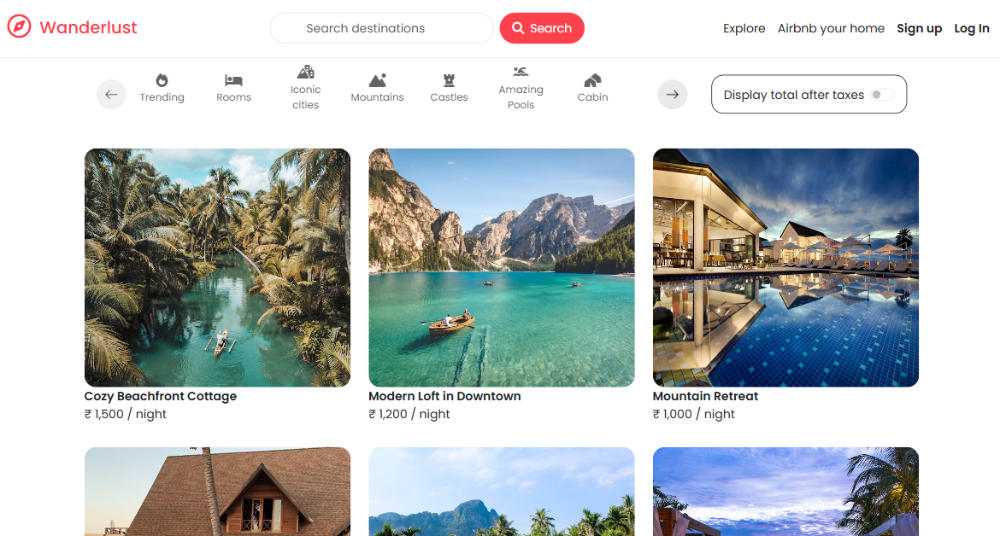
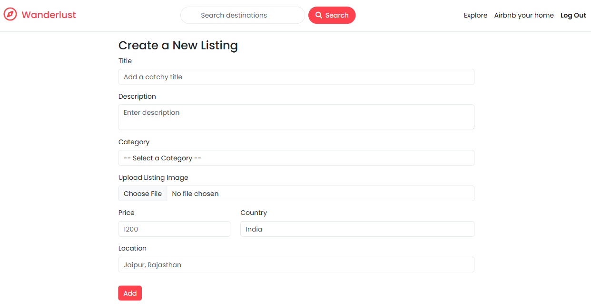

<h1 align="center">🚀 Wanderlust: Review Listing and Plan Your Next Adventure</h1>

<p align="center">
  ✈️ A full-featured travel listing and review platform built with <strong>Node.js</strong>, <strong>Express.js</strong>, <strong>MongoDB</strong>, <strong>EJS</strong>, and <strong>Cloudinary</strong> — featuring dynamic UI, authentication, cloud image uploads, interactive maps, and MVC architecture.
</p>

<p align="center">
  
  
  
  
  
  
</p>

---

## 🔥 Features

- 🔐 Secure user authentication with *Passport.js*
- 🧾 Form validation using *Joi*
- ☁️ Cloud image uploads via *Cloudinary*
- 💬 Flash messages for real-time UI feedback
- 📦 Modular MVC architecture: *Controllers, Models, Routes, Views*
- 🌍 Dynamic pages rendered with *EJS*
- ⚙️ Deploy-ready with *Render*

---

## 📁 Project Structure
```bash

Wanderlust/
│
├── controllers/       # Logic for each route
├── models/            # Mongoose schemas
├── public/            # Static assets (CSS, JS, images)
├── screenshots/       # Screenshots for readme
├── routes/            # Express route files
├── utils/             # Helper functions
├── views/             # EJS templates
│
├── app.js             # Main Express server
├── cloudConfig.js     # Cloudinary setup
├── middleware.js      # Auth & error handlers
├── schema.js          # Joi validation schemas
├── .env               # Environment variables
└── README.md          # You're here!
```

---

## 🚀 Getting Started

### 1️⃣ Clone the repo

```bash
git clone https://github.com/coderajawat/WANDERLUST.git
cd Wanderlust
```

### 2️⃣ Install dependencies
```bash
npm install
```

### 3️⃣ Setup environment variables

Create a .env file in the root folder:
```bash
CLOUD_NAME=your_cloudinary_cloud_name
CLOUD_API_KEY=your_cloudinary_api_key
CLOUD_API_SECRET=your_cloudinary_api_secret
MAP_TOKEN=your_mapbox_token
ATLASDB_URL=your_mongodb_connection_string
SECRET=your_session_secret
DEFAULTUSER_PASSWORD=your_default_user_password
```


### 4️⃣ Start the development server

```bash
node app.js
```
Go to 👉 [http://localhost:8080/listings](http://localhost:8080/listings)

---

## 🖼️ Screenshots

<div align="center">
  
  <br /><br /><hr /><br /><br />
  
</div>

---

## 🧠 Concepts You'll Learn

- MVC pattern with Express.js
- EJS templating engine
- Passport.js authentication
- MongoDB with Mongoose ORM
- Cloudinary integration for image uploads
- Flash messaging system
- Middleware-based validation (Joi)
- RESTful routing and modular structure

---

## 👨‍💻 Developer

*Khushi Rajawat*  
🌐 [LinkedIn](https://www.linkedin.com/in/khushi-rajawat-34309a211/) 
📫 Email: [khushirajawat755@gmail.com](mailto:khushirajawat755@gmail.com)  

---

## 📄 License

This project is licensed under the *MIT License*.  
Feel free to use, fork, and contribute 💙

---

<p align="center">
  ⭐ If you found this project helpful or inspiring, please give it a star!
</p>
